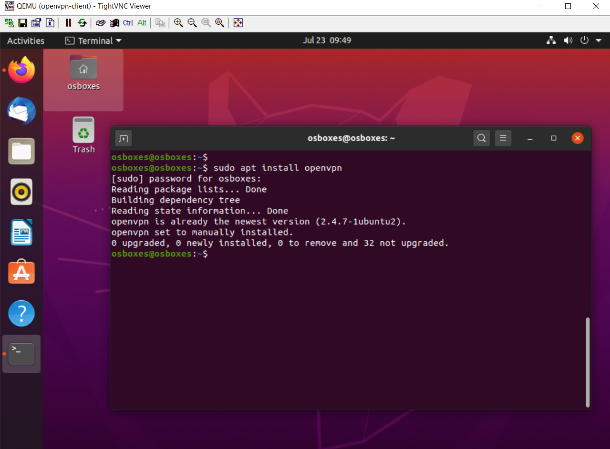
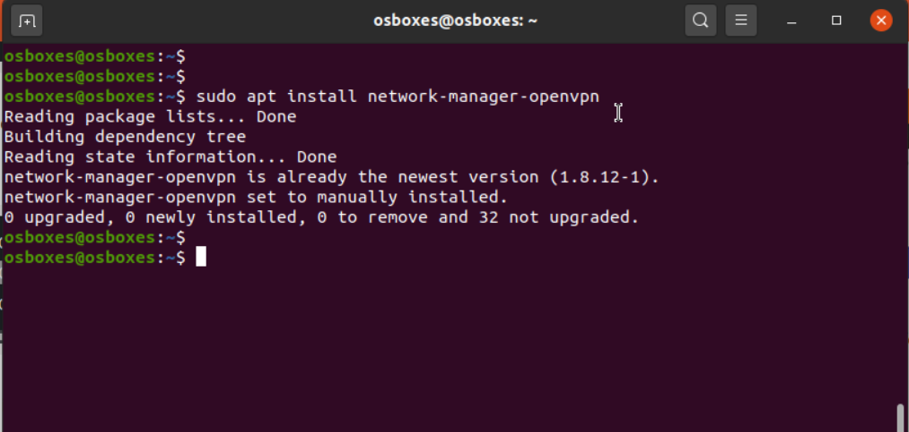
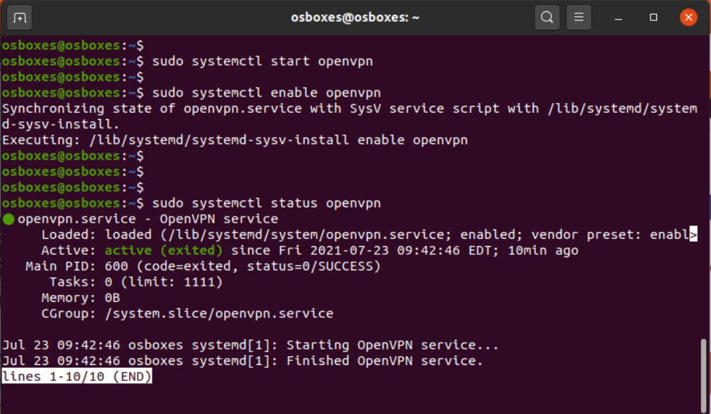
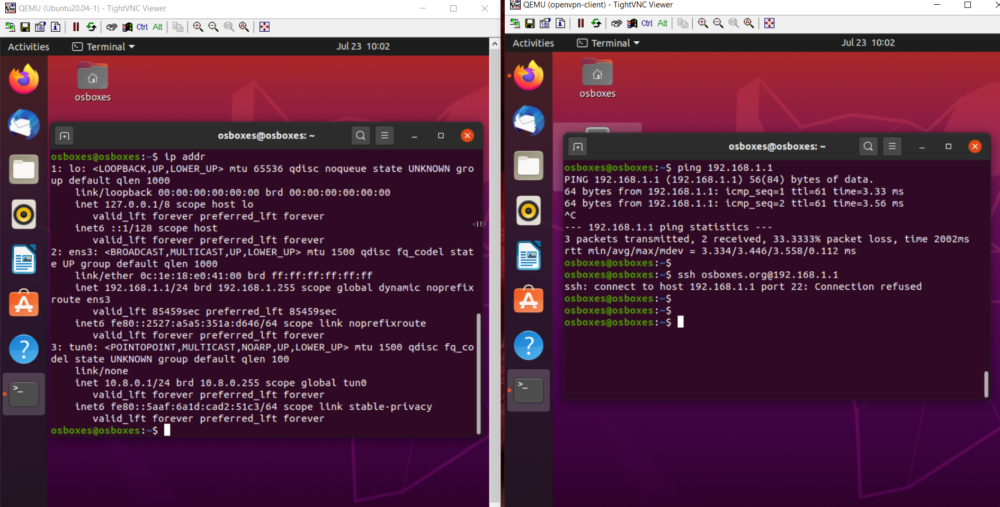
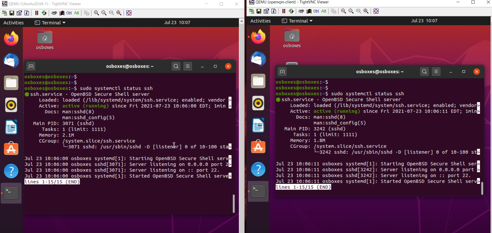
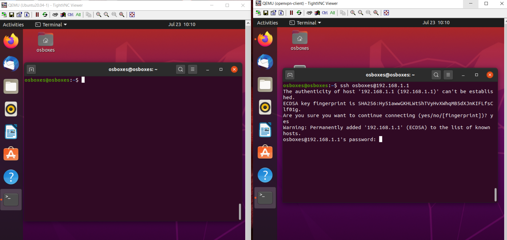
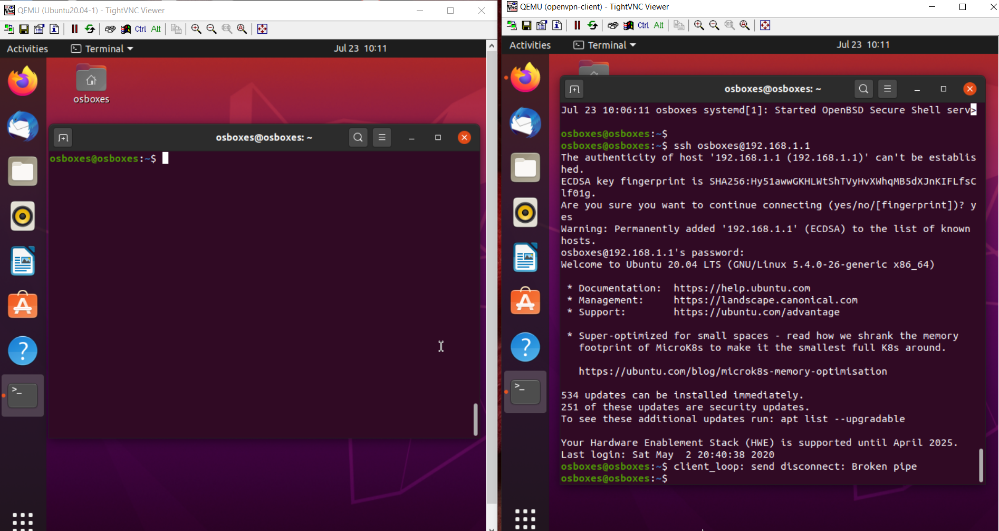
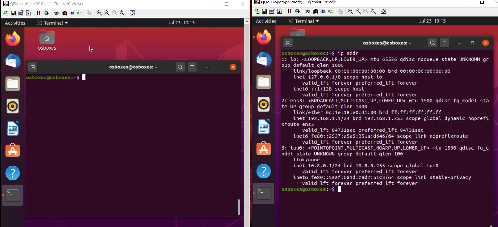
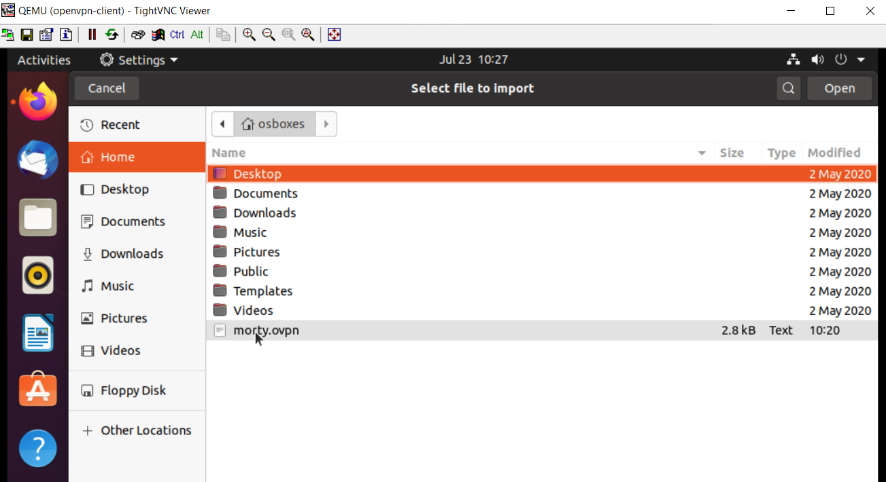
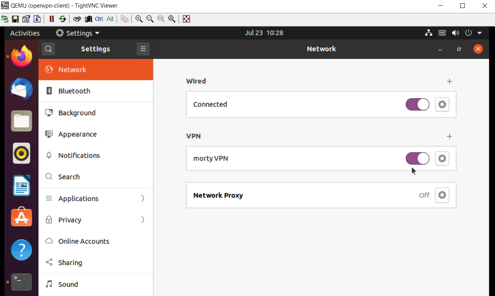

# OpenVPN-on-GNS3
# How to install OpenVPN (Virtual Private Network) in Ubuntu Desktop Guest 20.4 as OpenVPN server and Client

:pushpin: in this topology I'll show you how to install OpenVpn in different instruments and how to create the connection between them in the different networks.

##

 # Step 1: Setting Up OpenVPN Server on Ubuntu
 ##
 :pushpin: first we are going to receive all update packets using :~$ sudo apt get update command:
 
 ##
 
 
 :pushpin: we will be using a script that lets you set up your own secure OpenVPN server in a matter of seconds. 
 ##
 :pushpin: so we are going to download the installer script using the curl command-line tool, then make it executable using the chmod command as follows.
 
 ##
 ``
 :~$ curl -O https://raw.githubusercontent.com/angristan/openvpn-install/master/openvpn-install.sh
``
##

##

##
``
 :~$ chmod +x openvpn-install.sh 
`` 
##

##
 
 
##

##
:pushpin: Next, run the executable installer script as shown.
##

When executed for the first time, the script will ask you some questions, read them carefully, and provide answers according to your preferences, to set up your OpenVPN server.

##
 
 
## 

 
##

 
##

##

##
Once the VPN installation process is complete, a client configuration file will be written under the current working directory. This is the file you will use to configure your OpenVPN client as described in the next section.

##

 
##

Next, confirm that the OpenVPN service is up and running by checking its status using the following:
 
##

##
``
:~$ sudo systemctl status openvpn
``
##

##

##
 If you check your network interfaces, a new interface has been created for a VPN tunnel, you can confirm this by using IP command.
 
##

##
``
:~$ IP addr
``

##
##

##

Also, confirm that the OpenVPN daemon is listening on the port you instructed the script to use, using the ss command as shown.

##
``
:~$ sudo ss -tupln | grep openvpn
``
##

##

##
 
 
# Step 2: Setup OpenVPN Clients in Ubuntu 
 
:pushpin: Now its time to set up your OpenVPN client and connect it to the VPN server. First, install the OpenVPN package in the client machine as follows.
 
##
``
sudo apt install openvpn
``

##

## 
 
##
On a desktop system, you also need to install the network-manager-openvpn package to make VPN settings from the graphical interface.

##

##

``
sudo apt-get install network-manager-openvpn
``
##
##

## 
 
After installing the above packages, start the OpenVPN service, for now, enable it to automatically start at system boot and check its status to confirm that it’s up and running.

``
sudo systemctl start openvpn 
``
##
``
sudo systemctl enable openvpn
``
##
``
sudo systemctl status openvpn
``

##

##
 
 
:pushpin: Check if you can reach the server from the client using ping and ssh commands: 

## 

## 
##

If you need to install SSH on your instruments, you can use the following command: 

##
``
sudo apt-get install ssh
``
##

 
 
##

and the check its status: 

``
sudo systemctl status ssh
``
##

 
 
##

##

Now check if you can reach your server using ssh, and use ip addr command to see its interfaces: 

##

 

##

##

 

##

##

 

##

Now you need to import the OpenVPN client settings from the OpenVPN server. Open a terminal window and use the SCP command to grab the file as shown:

##
``
scp osboxes@10.8.0.1:/home/osboxes/morty.ovpn .
``
##

##
 
##

##
Open system Settings, then go to Networks. Under VPN, click the add button to get the necessary options.
##

##
 

##

##
 

##

##
 

##
After importing the file, the VPN settings should be added as shown in the following screenshot. Then click Add.

##
 

##

Your VPN client settings should be added successfully. You can connect to the OpenVPN server by turning on the VPN as highlighted in the following screenshot.

##
 
##

If you check your network interface connections using the IP add command, there should now exist a VPN tunnel interface as highlighted in the following screenshot.

##
 
##

