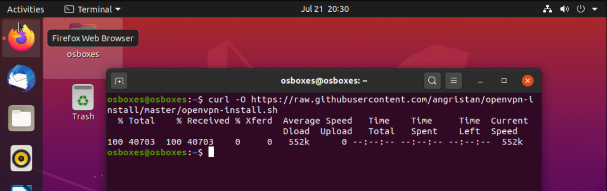

# OpenVPN-on-GNS3
# How to install OpenVPN (Virtual Private Network) in Ubuntu Desktop Guest 20.4 as OpenVPN server and Client

:pushpin: in this topology I'll show you how to install OpenVpn in different instruments and how to create the connection between them in the different networks.

##

 # Step 1: Setting Up OpenVPN Server on Ubuntu
 ##
 :pushpin: first we are going to receive all update packets using :~$ sudo apt get update command:
 
 ##
 
 
 :pushpin: we will be using a script that lets you set up your own secure OpenVPN server in a matter of seconds. 
 ##
 :pushpin: so we are going to download the installer script using the curl command-line tool, then make it executable using the chmod command as follows.
 
 ##
 ``
 :~$ curl -O https://raw.githubusercontent.com/angristan/openvpn-install/master/openvpn-install.sh
``
##

##

##
``
 :~$ chmod +x openvpn-install.sh 
`` 
##

##
 
 
##

##
:pushpin: Next, run the executable installer script as shown.
##

When executed for the first time, the script will ask you some questions, read them carefully, and provide answers according to your preferences, to set up your OpenVPN server.

##
 
 
## 

 
##

 
##

##

##
Once the VPN installation process is complete, a client configuration file will be written under the current working directory. This is the file you will use to configure your OpenVPN client as described in the next section.

##

 
##

Next, confirm that the OpenVPN service is up and running by checking its status using the following:
 
##

##
``
:~$ sudo systemctl status openvpn
``
##

##

##
 If you check your network interfaces, a new interface has been created for a VPN tunnel, you can confirm this by using IP command.
 
##

##
``
:~$ IP addr
``

##
##

##

Also, confirm that the OpenVPN daemon is listening on the port you instructed the script to use, using the ss command as shown.

##
``
:~$ sudo ss -tupln | grep openvpn
``
##

##

##
 
 
# Step 2: Setup OpenVPN Clients in Ubuntu 
 
:pushpin: Now its time to set up your OpenVPN client and connect it to the VPN server. First, install the OpenVPN package in the client machine as follows.
 
##
``
sudo apt install openvpn
``

##

## 
 
##
On a desktop system, you also need to install the network-manager-openvpn package to make VPN settings from the graphical interface.

##

##
``
sudo apt install network-manager-openvpn

``

##
##

## 
 
 
 
 ##
:pushpin: 1- La commande TRACERT
 
 :pushpin: 2- Firewalld. D'abord je vous explique comment installer firewalld sur votre serveur,et comment le configurer. Et après, le configurer d'une manière que seulement une           spécifique address IP ait l'autorité de le conneceter. À la suite, vous utilisez SSH et l'address IP de l'interface de votre OpenVPN pour vous connecter à votre serveur.
 

 :star: D'abord en utilisant les commmandes suivantes on va recevoire les derniers mis à jours.
 
 :~$ sudo apt-get update
 
 :~$ sudo apt-get upgrade
 
 
 
